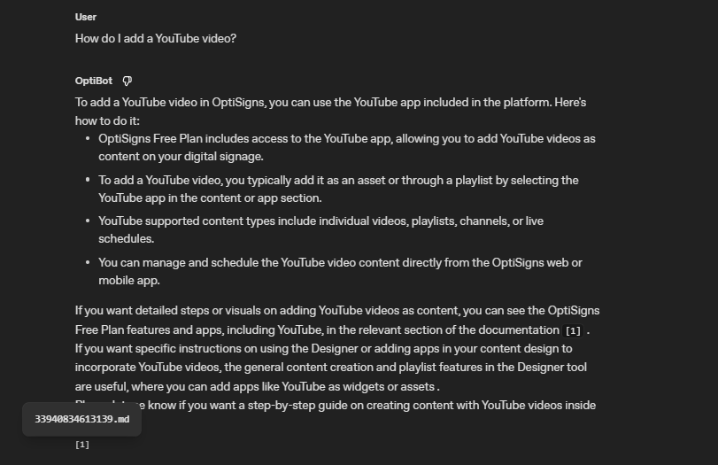

# AI Data Sync Pipeline

A **production-ready data pipeline** that automates web scraping, detects content changes using **Delta Sync**, and synchronizes data with **OpenAI Assistants via Vector Stores**.

---

## 🚀 Setup & Installation

### Prerequisites

* **Docker** installed on your machine
* **OpenAI API Key**
* **OpenAI Assistant ID**

---

### Environment Configuration

1. Clone the repository:

   ```bash
   git clone <repository-url>
   cd <repository-name>
   ```

2. Create a `.env` file based on `.env.sample`:

   ```text
   OPENAI_API_KEY=your_openai_api_key
   ASSISTANT_ID=your_assistant_id
   ```

---

## 🛠 How to Run Locally

### Using Docker (Recommended)

1. **Build the Docker image**:

   ```bash
   docker build -t data-sync-bot .
   ```

2. **Run the container** (override environment variables if needed):

   ```bash
   docker run -e OPENAI_API_KEY=your_actual_key_here data-sync-bot
   ```

🔹 The pipeline runs **once**, performs the delta sync, and exits with **code 0** on success.

---

## 📈 Deployment & Daily Job

This project is designed to run as a **Scheduled Job** (e.g., DigitalOcean App Platform Jobs, GitHub Actions, CronJob).

### Deployment Strategy

* The Docker container is triggered **daily**.
* Each run re-scrapes content and syncs updates to OpenAI.

### Delta Sync Logic

* Uses **MD5 hashing** to compare current content with the previous snapshot.
* Only **new or modified articles** are uploaded.
* Prevents duplicate uploads and **reduces API costs**.

### Chunking Strategy
* For the AI to accurately find information, I rely on OpenAI's File Search chunking. This strategy automatically breaks down large documents into smaller, overlapping segments. This ensures that when a user asks a question, the Assistant can retrieve the most relevant 'chunk' and provide precise citations.

### Execution Logs

* Logs for each execution are written to:

  ```text
  last_run.log
  ```

---

## 📊 Evidence & Results

### Log Summary

Each run provides clear, structured logs:

* **Added**: New articles detected and uploaded
* **Updated**: Existing articles with content changes
* **Skipped**: Articles unchanged since last run

### OpenAI Playground Verification

* The Assistant answers queries using the synced Vector Store
* Responses include **accurate citations** and **relevant source context**


---

## 🏗 Project Structure

```text
.
├── scraper/        # Node.js automated web scraper
├── pipeline/       # Python delta detection & OpenAI sync logic
├── Dockerfile      # Multi-stage build for lightweight execution
├── .env.sample     # Environment variable template
└── README.md
```

---

## ✅ Key Features

* Automated web scraping
* Delta-based synchronization
* OpenAI Vector Store integration
* Dockerized & production-ready
* Cost-efficient and idempotent design

---

## 📌 Notes

* Ensure the Assistant has **File Search / Vector Store access** enabled
* Compatible with scheduled execution environments
* Designed for scalability and maintainability
